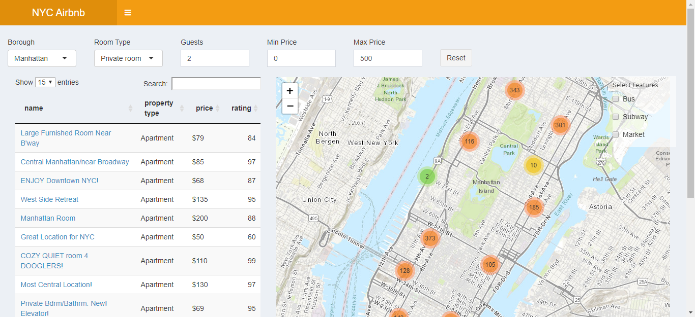
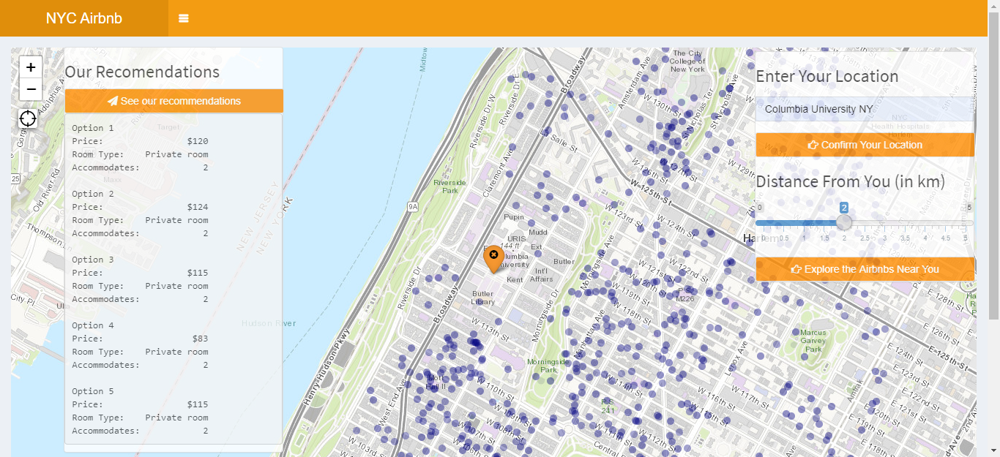
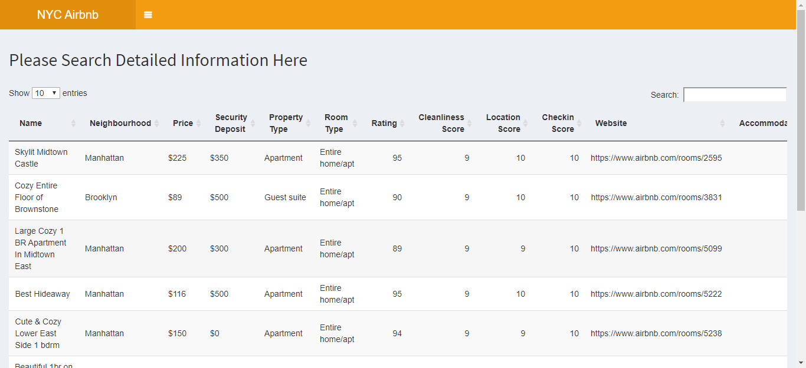

# Airbnb Recommendation APP 

[Link to Shiny App](https://shijie.shinyapps.io/Airbnb/)







## **Dataset**: 

The original datasets can be found [here](http://insideairbnb.com/get-the-data.html). 

## **Project summary**: 

I built a shiny app to assit users in choosing Airbnb rentals they would like to stay in New York City and give them recommendations. I also integrated datasets such as buses, subways and markets to visualize the places in maps in order to further enhance users' experience.


Search Page: Users can select their own choice of Airbnb rentals based on personal preferences. Key information of the selected Airbnbs will be displayed in the left table. The right panel shows the map of the Airbnb rentals in New York City. If clicked, key information of the places will popup. Information displayed on the data table will automatically sync as the users interact with the city map. 

Recommendation Page: This page provides random travel suggestions for users based on their preferences. Users can locate their current location or enter location they want in the input box. The App will track users' address and show users'  location on the map after users clicking "Confirm Your Location" button. Users can explore the Airbnb rentals within their specified distance and they can also get recommendations from the app. 

Data Page: Users can dig into detailed information of the Airbnb rentals in NYC.


Following [suggestions](http://nicercode.github.io/blog/2013-04-05-projects/) by [RICH FITZJOHN](http://nicercode.github.io/about/#Team) (@richfitz). This folder is orgarnized as follows.

```
proj/
|-- app/
|-- lib/
|-- data/
|-- doc/
|-- output/
```

Please see each subfolder for a README file.

